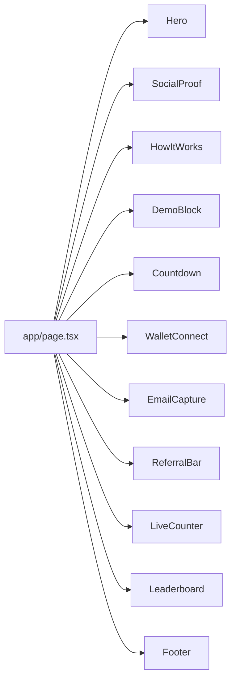
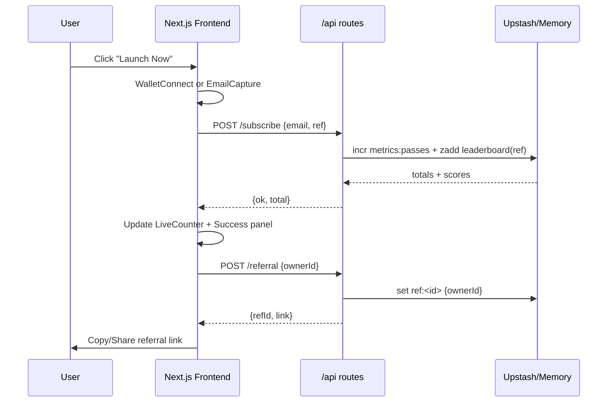
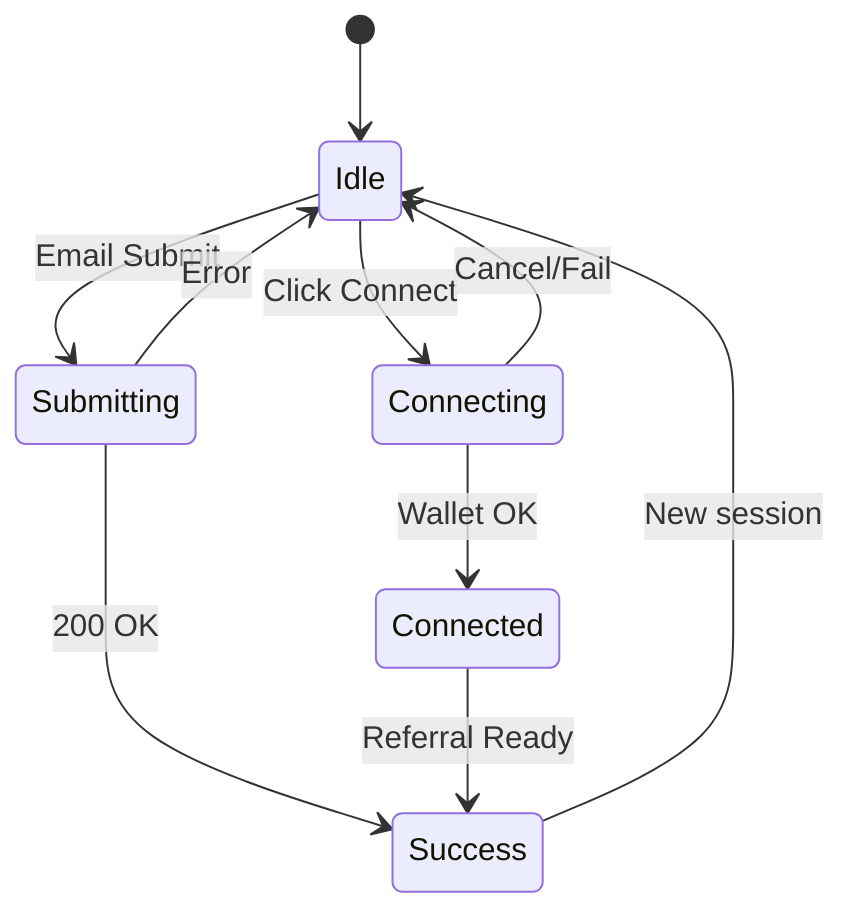

# Front-End Flow (Launch Now)

## 1) UX Journey
```mermaid
flowchart TD
  A[Visitor lands] --> B{Has ?r referral}
  B -- yes --> C[Store ref in localStorage]
  B -- no --> D[Continue]
  C --> D
  D --> E[Hero CTA: Launch Now]
  E --> F[Connect Wallet]
  E --> G[Email Capture]
  F --> H{Connected?}
  H -- yes --> I[Generate my referral link]
  H -- no --> G
  G --> J[POST /api/subscribe]
  I --> K[Success Panel + Share]
  J --> L[Increment Live Counter]
  L --> M[Leaderboard view]
  K --> M
  M --> N[Share link → new visits (?r)]
```

## 2) Component Map


## 3) Data & API Flow



## 4) CTA State Machine


