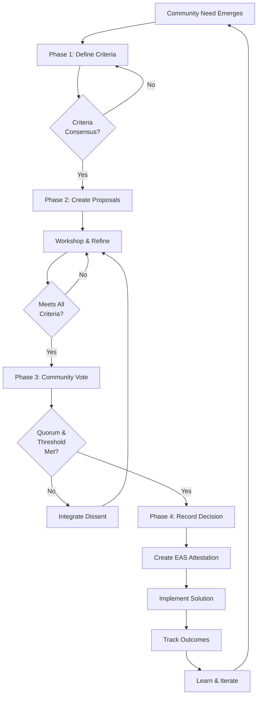

# Launch Now Governance

## Overview

Launch Now implements an on-chain DAO using **Convergent Facilitation** — a principled approach to decision-making that transforms dissent into consensus by integrating all human needs. This governance model moves through four core phases: Criteria → Proposal → Decision → Record.

## Convergent Facilitation Process

### Phase 1: Criteria

The community collaboratively defines the criteria that any solution must meet. These criteria represent the underlying needs of all stakeholders, not just their positions.

**Key Activities:**
- Stakeholders share their needs and concerns
- Facilitators help translate positions into underlying needs
- Criteria are refined to ensure they represent universal human needs
- All criteria must be accepted by the community before moving forward

### Phase 2: Proposal

Solutions are crafted to meet all established criteria. Multiple proposals can emerge, each attempting to satisfy the full set of needs.

**Key Activities:**
- Community members draft proposals that address all criteria
- Proposals are workshopped and refined
- Each proposal is evaluated against the criteria
- Dissent is welcomed as information to improve proposals

### Phase 3: Decision

The community evaluates proposals and makes decisions through a consensus-seeking process enhanced by token-weighted voting.

**Key Activities:**
- LN-GOV token holders vote on proposals
- Votes are weighted by token balance and attestation score
- Decisions require meeting a dynamic quorum
- Minority concerns are integrated through amendments

### Phase 4: Record

All decisions are recorded on-chain with immutable attestations, creating a transparent governance history.

**Key Activities:**
- Decisions are recorded as EAS (Ethereum Attestation Service) attestations
- Implementation milestones are tracked
- Community learns from outcomes to improve future governance

## LN-GOV Tokenomics

### Token Design

**LN-GOV** is a hybrid governance token that combines:
- **ERC-20** standard for transferability and composability
- **EAS Attestations** for reputation and participation tracking

### Token Attributes

| Attribute | Description |
|-----------|-------------|
| **Name** | Launch Now Governance Token |
| **Symbol** | LN-GOV |
| **Standard** | ERC-20 |
| **Initial Supply** | 1,000,000,000 LN-GOV |
| **Decimals** | 18 |

### Token Distribution

```
Initial Distribution:
├─ Community Treasury (40%) - 400,000,000 LN-GOV
├─ Ecosystem Growth (25%) - 250,000,000 LN-GOV
├─ Core Contributors (20%) - 200,000,000 LN-GOV (2-year vest)
├─ Early Adopters (10%) - 100,000,000 LN-GOV
└─ Liquidity Provision (5%) - 50,000,000 LN-GOV
```

### Attestation System

The governance system uses **Ethereum Attestation Service (EAS)** to track:

1. **Participation Attestations**
   - Criteria contribution
   - Proposal submission
   - Constructive dissent
   - Integration work

2. **Reputation Attestations**
   - Governance experience
   - Facilitation skills
   - Domain expertise
   - Trust relationships

3. **Decision Attestations**
   - Voting records
   - Proposal outcomes
   - Implementation status
   - Impact assessments

### Voting Power Calculation

```
Voting Power = Token Balance × Attestation Multiplier

Where Attestation Multiplier = 1 + (Attestation Score / 100)

Example:
- User with 1,000 LN-GOV and Attestation Score of 50
- Voting Power = 1,000 × (1 + 50/100) = 1,500
```

## Governance Flow Diagram



## Token Flow Diagram

```mermaid
graph LR
    A[LN-GOV Token Holder] -->|Stake| B[Governance Contract]
    B -->|Participate| C[Criteria Phase]
    B -->|Participate| D[Proposal Phase]
    B -->|Vote| E[Decision Phase]
    
    C -->|Earn| F[Participation Attestation]
    D -->|Earn| F
    E -->|Earn| F
    
    F -->|Increases| G[Attestation Score]
    G -->|Boosts| H[Voting Power]
    
    H -->|Influence| E
    
    E -->|Record| I[EAS Attestation]
    I -->|Immutable| J[On-chain Record]
    
    B -->|Unstake| A
    
    K[Community Treasury] -->|Rewards| A
    K -->|Grants| L[Ecosystem Projects]
    
    M[Protocol Revenue] -->|Flow to| K
    
    style F fill:#4ade80
    style G fill:#4ade80
    style I fill:#60a5fa
    style J fill:#60a5fa
```



## Governance Parameters

### Voting Parameters

| Parameter | Value | Description |
|-----------|-------|-------------|
| **Proposal Threshold** | 10,000 LN-GOV | Minimum tokens to create proposal |
| **Voting Period** | 7 days | Duration of voting |
| **Quorum** | Dynamic | Based on recent participation |
| **Approval Threshold** | 66% | Supermajority required |
| **Veto Period** | 2 days | Time for minority to raise concerns |

### Attestation Parameters

| Parameter | Value | Description |
|-----------|-------|-------------|
| **Max Multiplier** | 2.0x | Maximum voting power boost |
| **Attestation Decay** | 5% per quarter | Encourages ongoing participation |
| **Schema Registry** | EAS Network | Ethereum Attestation Service |

## Smart Contract Architecture

### Core Contracts

1. **LNGovToken.sol**
   - ERC-20 implementation
   - Voting checkpoint system
   - Attestation integration hooks

2. **GovernanceHub.sol**
   - Phase management
   - Proposal lifecycle
   - Vote aggregation

3. **CriteriaRegistry.sol**
   - Criteria submission and voting
   - Criteria versioning
   - Consensus tracking

4. **AttestationManager.sol**
   - EAS integration
   - Score calculation
   - Multiplier management

5. **Treasury.sol**
   - Fund management
   - Reward distribution
   - Grant allocation

## Integration Rewards

Launch Now uniquely rewards those who do the work of **integration** — the facilitation work that brings all voices together:

- **Criteria Integration**: Rewards for translating positions into shared needs
- **Proposal Synthesis**: Rewards for crafting solutions that meet all criteria
- **Dissent Integration**: Rewards for incorporating minority concerns
- **Facilitation**: Rewards for shepherding proposals through governance

These rewards are distributed from the Community Treasury and are tracked via attestations, creating a **wallet-native governance system** that incentivizes consensus-building rather than merely voting power.

## Getting Started

### For Token Holders

1. Acquire LN-GOV tokens
2. Connect your wallet to the Launch Now dApp
3. Participate in governance phases
4. Earn attestations by contributing meaningfully
5. Watch your voting power grow with your reputation

### For Facilitators

1. Complete facilitator onboarding
2. Receive facilitator attestation
3. Help community members articulate needs
4. Guide proposals through the phases
5. Earn integration rewards

### For Developers

1. Review the smart contract documentation
2. Join the developer community
3. Build on the Launch Now protocol
4. Apply for ecosystem grants
5. Contribute to the codebase

## Resources

- [Launch Now Website](https://launch-now.org)
- [Smart Contracts Repository](https://github.com/wildhash/launch-now-contracts)
- [Community Forum](https://forum.launch-now.org)
- [Convergent Facilitation Guide](https://convergentfacilitation.org)
- [EAS Documentation](https://attest.sh)

## License

This governance documentation is released under MIT License.

---

**Wallet-native governance rewarding integration.**
