# 🏛 Launch Now Token Governance System
**Subtitle:** *Embedding Convergent Facilitation into On-Chain Collective Intelligence*

## 1. Governance Vision
Launch Now DAO replaces majority voting with **Convergence Rule**, using a three-phase protocol inspired by *The Highest Common Denominator* to achieve decisions that everyone can accept as their own.

## 2. Architecture
| Layer | Purpose | Mechanism |
| :-- | :-- | :-- |
| Commons Mandate | Shared purpose and DAO constitution | NFT signature of intent |
| Convergent Decision Protocol | Criteria → Proposal → Decision → Record | Smart contracts |
| Outlier Inclusion Engine | Convert dissent to insight | AI (Omni + Reflexion) |
| Steward Council | Rotating facilitators | Reputation-based weighting |
| Transparency Layer | Visible rationale | On-chain logs + dashboard |

## 3. Three-Phase Protocol
1. **Criteria Phase** — collect needs → "noncontroversial essence."  
2. **Proposal Phase** — create integrative solutions addressing criteria.  
3. **Decision Phase** — record "willing/unwilling," not yes/no → only passes when all are willing.

## 4. Smart-Contract Model
```solidity
enum Phase { Criteria, Proposal, Decision }

struct Criterion { string essence; address proposer; uint upvotes; }
struct Proposal { string summary; uint[] criteriaIds; bool finalized; }
struct Vote { bool willing; string rationale; }

mapping(uint => Criterion) public criteria;
mapping(uint => Proposal) public proposals;
mapping(uint => mapping(address => Vote)) public votes;

function submitCriterion(string calldata _essence) external;
function submitProposal(string calldata _summary, uint[] calldata _criteriaIds) external;
function recordVote(uint _proposalId, bool _willing, string calldata _rationale) external;
function finalize(uint _proposalId) external ifAllWilling(_proposalId);
```

## 5. Token-Economic Flow Diagram


## 6. Governance Cycle Diagram

```mermaid
sequenceDiagram
    participant M as Member
    participant F as Facilitator (Human + AI)
    participant C as Smart Contract
    participant T as Treasury
    M->>F: Submit criteria (needs, concerns)
    F->>C: Record criteria on-chain
    C-->>M: Criteria List published
    M->>F: Submit proposal aligned to criteria
    F->>C: Verify integration completeness
    M->>C: Cast willingness votes
    C-->>F: Detect dissent / reintegrate
    F->>C: Update proposal → convergence
    C->>T: Release rewards + record decision
    T-->>M: Distribute LN-GOV tokens
```



## 7. Metrics Dashboard (Quantitative Governance)

| Metric                          | Definition                                          |
| :------------------------------ | :-------------------------------------------------- |
| **Convergence Score (CS)**      | % of criteria met per proposal                      |
| **Inclusion Index (II)**        | # of unique voices represented / total participants |
| **Facilitation Integrity (FI)** | Dissent resolved ÷ total dissent                    |
| **Governance Health (GH)**      | Weighted mean of CS, II, FI                         |

## 8. Agent Roles

| Agent                | Function                                       |
| :------------------- | :--------------------------------------------- |
| **Omni Facilitator** | Extracts criteria, moderates convergence       |
| **Reflexion Engine** | Learns from prior decisions to improve process |
| **Guardian Agent**   | Detects coercion patterns & integrity breaches |

## 9. Cultural Charter

* Everyone matters; nothing coerced.
* Dissent = Data.
* Steward the Whole.
* Transparency = Trust.
* Willingness > Preference.
